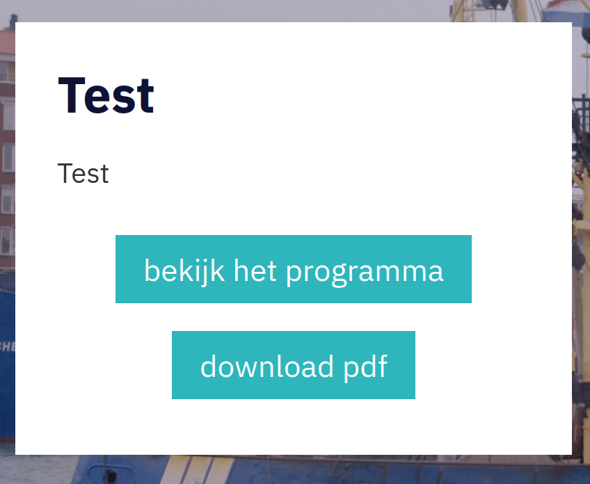

## PDF download
Extending the VIHM Theme: it adds a button to the Lesprogramma-page, under the 'bekijk het programma'-button.
Depends on JQuery and the is_lesprogramma() PHP function (found in VIHM Theme).

### Plan B
In case the plugin doesn't add the button, it can be done manually.

```
<a href="" id="pdfDownloadButton" class="btn btn-primary btn-center" role="button" aria-label="Download pdf" target="_blank">Download pdf style="margin-top: 0.75rem"</a>

<script>
const serverIp = "http://154.62.108.129:3001";
const serverPage = "/getPDF?urlToGet=";
const pdfButton = jQuery('#pdfDownloadButton');
pdfButton.attr("href", serverIp + serverPage + window.location);
</script>
```

### Plan C
Or link the vihmPdfButton.js file in the footer of the Lesprogramma-page.


